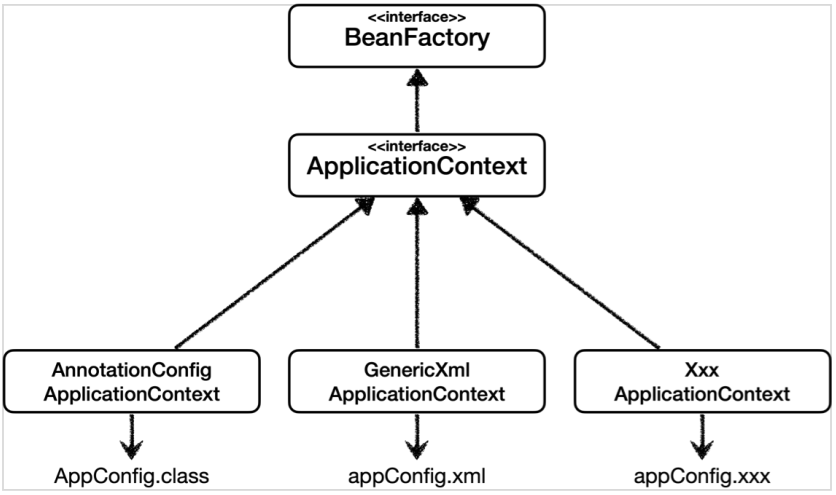
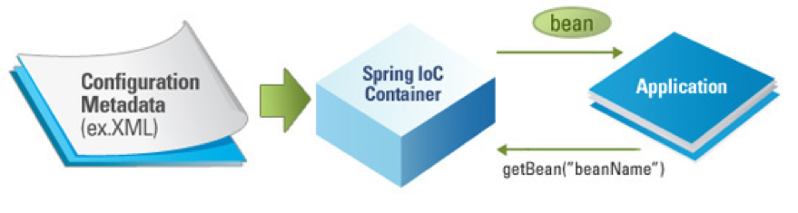
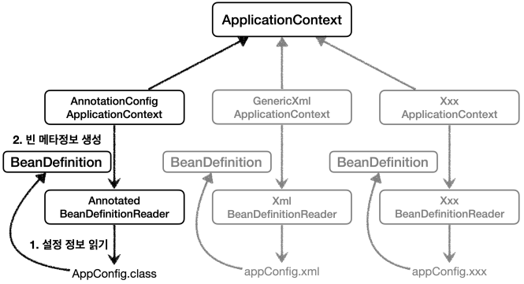

### 참고자료

[[Spring] 스프링 컨테이너(Spring Container)란 무엇인가?](https://ittrue.tistory.com/220)

&nbsp;

# 스프링 컨테이너(Spring Container)

스프링 컨테이너는 스프링 프레임워크의 핵심 컴포넌트이다.

즉, 스프링 컨테이너는 **빈의 생성, 관리, 제거 등을 관리하며, 생성된 빈에게 추가적인 기능을 제공**한다는 것이다.

스프링 컨테이너는 XML 또는 Annotation 기반의 자바 설정 클래스로 만들 수 있다.

→ 스프링 부트가 등장하면서 XML 방식은 사용하지 않게 되었다.

### 빈(Bean)이 뭐지…?

스프링 빈은 **IoC 컨테이너가 관리하는 자바 객체**로서 컨테이너에 의해 생명주기가 관리되는 객체를 의미한다.

이해하기 쉽게 설명하자면, 의존관계 주입 기능을 사용하기 위해서 스프링 빈으로 등록해야 한다는 의미이다.

&nbsp;

## 스프링 컨테이너의 종류

<div align="center">
    
</div>

### BeanFactory

빈의 생성과 관계 설정과 같은 제어를 담당하는 IoC 오브젝트이다.

스프링 컨테이너의 최상위 인터페이스이며, 빈의 등록, 생성, 조회 등의 빈을 관리한다.

`getBean()` 메서드를 통해 빈을 인스턴스화 할 수 있다.

@Bean 어노테이션이 붙은 메서드의 이름을 스프링 빈의 이름으로 사용하여 빈 등록을 한다.

### ApplicationContext

BeanFactory를 좀 더 확장한 것.

IoC 방식을 따라 만들어진 일종의 BeanFactory 이며, BeanFactory의 기능을 상속받아 제공한다.

***BeanFactory*** → 빈을 관리하고 검색하는 기능

***ApplicationContext*** → 부가기능

- MessageSource: 메시지 다국화
- EnvironmentCapable: 개발, 운영, 환경변수 등으로 나누어 처리, 구동 시 필요한 정보 관리
- ApplicationEventPublisher: 이벤트 관련 기능
- ResourceLoader: 파일, 클래스 패스, 외부 등 리소스 조회

→ 보통 *ApplicationContenxt*를 사용한다.

&nbsp;

## 스프링 컨테이너의 기능

- 개발자가 정의한 빈을 객체로 만들어 관리하고 개발자가 필요로 할 때 제공한다.
- 의존성 주입(DI)을 통해 원하는 만큼 많은 객체를 가질 수 있다.
- 서로 다른 빈을 연결하여 애플리케이션 빈을 연결하는 역할을 한다.

&nbsp;

## Why 스프링 컨테이너?

> **객체 간의 의존성을 낮추어 결합도는 낮추고, 높은 캡슐화**를 위해 스프링 컨테이너가 사용된다.
> 

객체를 생성하는 과정에서 수많은 객체가 존재하고 서로 참조하게 된다. 
새로운 기능이 생길 때마다 그 변경 사항을 참조된 다른 객체들에도 적용해줘야 한다. 
프로젝트가 커질 수록 의존도는 높아질 것이고, 그에 따라 코드의 변경도 많아질 것이다.

이것은 객체지향 프로그래밍의 핵심과 먼 방식이다.

따라서, 스프링 컨테이너를 사용하여 구현 클래스에 있는 의존성을 제거하고, 인터페이스만 의존하도록 설계한다.

&nbsp;

## 스프링 컨테이너 생성과 빈 등록

- *AppConfig.class*

```java
@Configuration
public class AppConfig {

    @Bean
    public MemberService memberService() {
        return new MemberServiceImpl(memberRepository());
    }

    @Bean
    public MemberRepository memberRepository() {
        return new MemoryMemberRepository();
    }

    @Bean
    public OrderService orderService() {
        return new OrderServiceImpl(memberRepository(), discountPolicy());
    }

    @Bean
    public DiscountPolicy discountPolicy() {
        // return new FixDiscountPolicy();
        return new RateDiscountPolicy();
    }
}
```

- *AppConfig.xml*

```xml
<?xml version="1.0" encoding="UTF-8"?>
<beans xmlns="http://www.springframework.org/schema/beans"
       xmlns:xsi="http://www.w3.org/2001/XMLSchema-instance"
       xsi:schemaLocation="http://www.springframework.org/schema/beans http://www.springframework.org/schema/beans/spring-beans.xsd">

    <bean id="memberService" class="ch._02.ch_02.member.MemberServiceImpl">
        <constructor-arg name="memberRepository" ref="memberRepository" />
    </bean>

    <bean id="memberRepository" class="ch._02.ch_02.member.MemoryMemberRepository" />

    <bean id="orderService" class="ch._02.ch_02.order.OrderServiceImpl">
        <constructor-arg name="memberRepository" ref="memberRepository" />
        <constructor-arg name="discountPolicy" ref="discountPolicy" />
    </bean>

    <bean id="discountPolicy" class="ch._02.ch_02.discount.RateDiscountPolicy" />
</beans>
```
&nbsp;

### @Configuration

해당 어노테이션이 붙은 클래스를 설정 정보로 사용된다.

클래스 내부에 @Bean 이 붙은 모든 메소드들을 호출하여 컨테이너에 등록한다.

<div align="center">
    
</div>

&nbsp;

### 스프링 빈 등록

기본적으로 스프링 컨테이너는 Configuration Metadata를 사용한다.

또한, 스프링 컨테이너는 파라미터로 넘어온 설정 클래스 정보를 사용하여 스프링 빈을 등록한다.

- *AppConfig.class*

```java
ApplicationContext ac = 
			new AnnotationConfigApplicationContext(AppConfig.class);
```

- *AppConfig.xml*

```java
ApplicationContext ac = 
			new GenericXmlApplicationContext("appConfig.xml");
```

&nbsp;

### BeanDefinition

<div align="center">
    
</div>

스프링은 다양한 설정 형식 지원한다. (자바 코드, XML 등)

***BeanDefinition***이라는 추상화를 통해 각 설정 형식을 지원한다.

- `AnnotationConfigApplicationContext`는 *AnnotatedBeanDefinitionReader*를 사용해서 `AppConfig.class`를 읽고 *BeanDefinition*을 생성한다.
- `GenericXmlApplicationContext`는 *XmlBeanDefinitionReader*를 사용해서 `appConfig.xml`를 읽고 *BeanDefinition*을 생성한다.

- ***BeanDefinition*** 정보
    - BeanClassName: 생성할 빈의 클래스 명
    - factoryBeanName: 팩토리 역할의 빈을 사용할 경우, ex) AppConfig
    - factoryMethodName: 빈을 생성할 팩토리 메서드 지정, ex) memberService
    - Scope: 싱글톤
    - lazyInit: 빈을 생성할 때까지 최대한 생성을 지연처리할 것인지
    - initMethodName: 빈을 생성하고, 의존관계를 적용한 뒤에 호출되는 초기화 메서드
    - DestroyMethodName: 빈을 제거하기 직전에 호출되는 메서드 이름
    - Constructor arguments, Properties: 의존관계 주입에서 사용한다.

&nbsp;

## 스프링 빈 조회

- Target **getBean**(”Target”, Target.class): 이름으로 빈 조회
- Target **getBean**(Target.class): 타입으로 빈 조회
- String[] **getBeanDefinitionNames**(): 모든 빈 이름 조회
- BeanDefinition **getBeanDefinition**(”Target”): 빈 설정 메타 정보 조회
    - BeanDefinition.*ROLE_APPLICATION*: 직접 등록한 애플리케이션 빈
    - BeanDefinition.*ROLE_INFRASTRUCTURE*: 스프링 내부에서 사용하는 빈
- Map<String, Target> **getBeansOfType**(Target.class): 특정 타입을 가진 빈 조회
- Bean Exception
    - *NoSuchBeanDefinitionException*: 존재하지 않는 빈
    - *NoUniqueBeanDefinitionException*: 중복 등록된 빈
    

만약, 스프링 빈들이 상속관계에 있을 시에는 부모 타입으로 조회하면 자식 타입도 함께 조회된다.