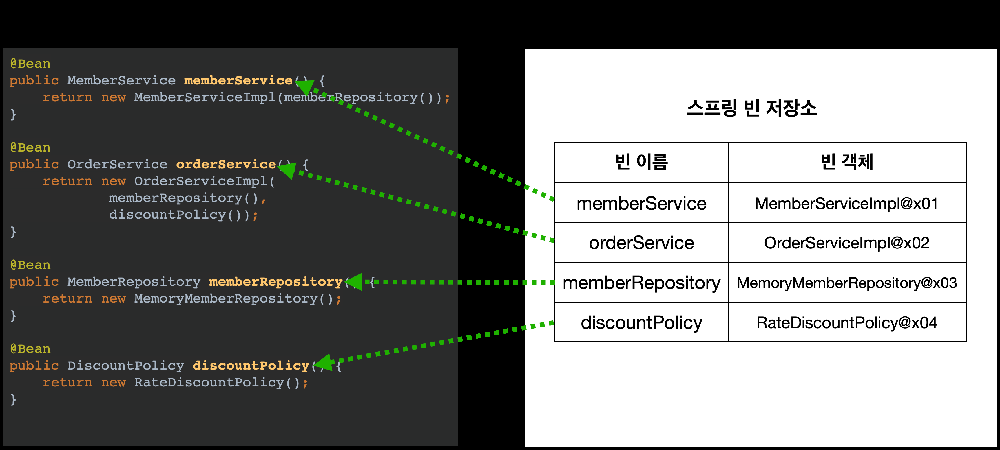
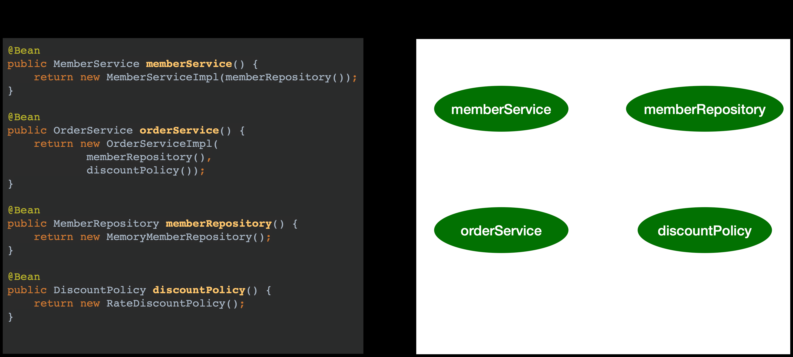
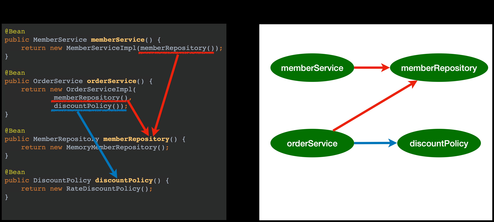
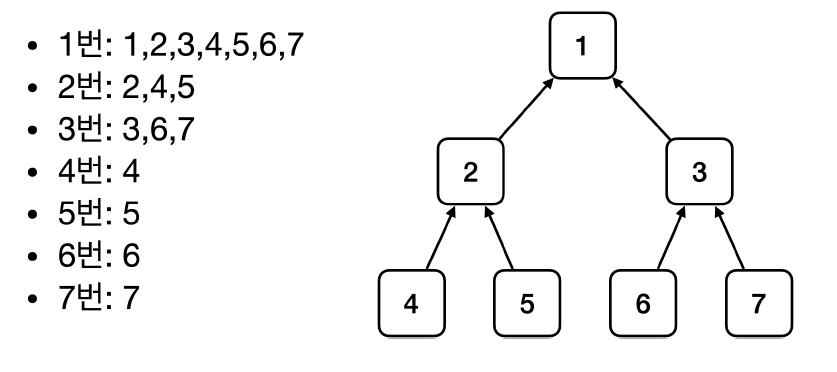
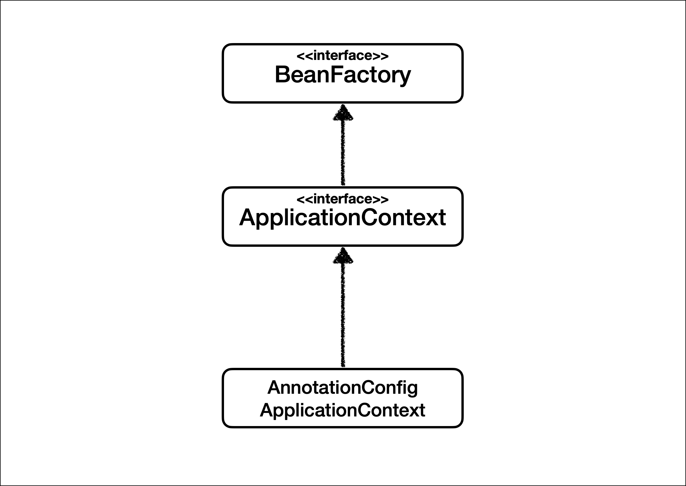
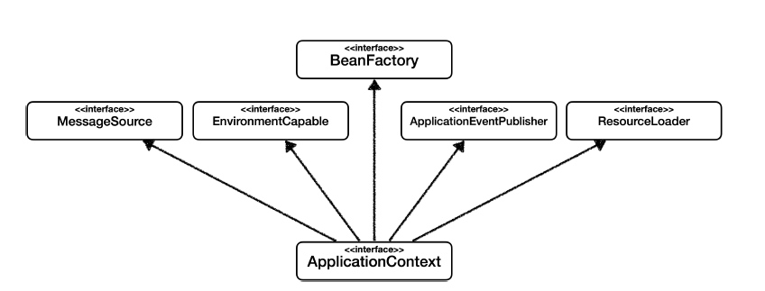

# 스프링 컨테이너와 스프링 빈
 
스프링 컨테이너는 스프링 프레임워크의 핵심 요소로, 스프링 빈을 생성하고 관리하는 역할을 수행합니다. 스프링 컨테이너는 빈의 라이프사이클을 관리하고, 의존성 주입을 통해 빈들 간의 관계를 설정합니다. 또한, 스프링 컨테이너는 애플리케이션의 설정 정보를 로드하여 빈들을 생성하고 관리합니다.

스프링 컨테이너가 생성되는 과정

```java
//스프링 컨테이너 생성
ApplicationContext applicationContext =
new AnnotationConfigApplicationContext(AppConfig.class);
```

스프링 컨테이너의 생성 과정

**1. 스프링 컨테이너 생성**`new AnnotationConfigApplicationContext(AppConfig.class)`
스프링 컨테이너를 생성할 때는 구성 정보를 지정해주어야 한다.
여기서는 `AppConfig.class` 를 구성 정보로 지정했다.

스프링 컨테이너를 생성 → 스프링 컨테이너(스프링 빈 저장소) → 구성 정보 활용 순

**2.스프링 빈 등록** 

스프링 컨테이너는 파라미터로 넘어온 설정 클래스를 사용해서 스프링 빈을 등록한다.



(@Bean이 붙은 것들을 보고 만들어진다)

빈 이름 특징: 각자 다른 이름으로 만들어야한다.

1. 빈 이름은 메서드 이름을 사용 (일반적)
2. 빈 이름을 직접 부여도 가능(`@Bean(name="memberService2")`)

**3.스피링 빈 의존관계 설정 - 준비**



**4.스피링 빈의존 관계 설정 - 완료**



스프링 컨테이너는 설정 정보를 참고해서 의존관계를 주입(DI)한다.

**참고**
스프링은 빈을 생성하고, 의존관계를 주입하는 단계가 나누어져 있다. 그런데 이렇게 자바 코드로 스프링 빈을 등록하면
생성자를 호출하면서 의존관계 주입도 한번에 처리된다. 여기서는 이해를 돕기 위해 개념적으로 나누어 설명했다. 자세
한 내용은 의존관계 자동 주입에서 다시 설명하겠다.

**컨테이너에 등록된 모든 빈 조회**
스프링 컨테이너에 실제 스프링 빈들이 잘 등록 되었는지 확인

**모든 빈 출력하기**

```java
String[] beanDefinitionNames = applicationContext.getBeanDefinitionNames();
for (String beanDefinitionName : beanDefinitionNames) {
    Object bean = applicationContext.getBean(beanDefinitionName);
    System.out.println("빈 이름: " + beanDefinitionName + ", 빈 객체: " + bean);
}

```

위의 코드를 실행하면 스프링에 등록된 모든 빈 정보를 출력할 수 있습니다. `getBeanDefinitionNames()` 메서드를 사용하여 스프링에 등록된 모든 빈 이름을 조회하고, `getBean()` 메서드를 사용하여 빈 이름으로 해당 빈 객체(인스턴스)를 조회합니다.

**애플리케이션 빈 출력하기**

```java
String[] beanDefinitionNames = applicationContext.getBeanDefinitionNames();
for (String beanDefinitionName : beanDefinitionNames) {
    BeanDefinition beanDefinition = applicationContext.getBeanDefinition(beanDefinitionName);
    if (beanDefinition.getRole() == BeanDefinition.ROLE_APPLICATION) {
        Object bean = applicationContext.getBean(beanDefinitionName);
        System.out.println("빈 이름: " + beanDefinitionName + ", 빈 객체: " + bean);
    }
}

```

위의 코드는 스프링이 내부에서 사용하는 빈을 제외하고, 내가 등록한 빈만 출력하는 방법입니다. `getRole()` 메서드를 사용하여 빈의 역할(role)을 구분할 수 있습니다. `ROLE_APPLICATION`은 일반적으로 사용자가 정의한 빈을 나타내며, `ROLE_INFRASTRUCTURE`은 스프링이 내부에서 사용하는 빈을 의미합니다.

위 쪽 조회기능이 전부다 출력하는 기능이였다면 여기부턴 일부만 선택해서 조회하기(실전)

**스프링 컨테이너에서 스프링 빈을 찾는 가장 기본적인 조회 방법**
`ac.getBean(빈이름, 타입)`

`ac.getBean(타입)`
조회 대상 스프링 빈이 없으면 예외 발생
 ●`NoSuchBeanDefinitionException: No bean named 'xxxxx' available`

**스프링 빈 조회 - 동일한 타입이 둘 이상**
타입으로 조회시 같은 타입의 스프링 빈이 둘 이상이면 오류가 발생한다. 이때는 **빈 이름을 지정**하자.
`ac.getBeansOfType()` 을 사용하면 해당 타입의 모든 빈을 조회할 수 있다.

**스프링 빈 조회 - 상속 관계**
부모 타입으로 조회하면, 자식 타입도 함께 조회한다.
그래서 모든 자바 객체의 최고 부모인 `Object` 타입으로 조회하면, 모든 스프링 빈을 조회한다.



**BeanFactory와 ApplicationContext**



**BeanFactory**
스프링 컨테이너의 최상위 인터페이스다.
스프링 빈을 관리하고 조회하는 역할을 담당한다.
`getBean()` 을 제공한다.
지금까지 우리가 사용했던 대부분의 기능은 BeanFactory가 제공하는 기능이다.

**ApplicationContext**
BeanFactory 기능을 모두 상속받아서 제공한다.
빈을 관리하고 검색하는 기능을 BeanFactory가 제공해주는데, 그러면 둘의 차이가 뭘까?
애플리케이션을 개발할 때는 빈을 관리하고 조회하는 기능은 물론이고, 수 많은 부가기능이 필요하다.

**ApplicatonContext가 제공하는 부가기능**



**메시지소스를 활용한 국제화 기능**
예를 들어서 한국에서 들어오면 한국어로, 영어권에서 들어오면 영어로 출력

**환경변수**
로컬, 개발, 운영등을 구분해서 처리

**애플리케이션 이벤트**
이벤트를 발행하고 구독하는 모델을 편리하게 지원

**편리한 리소스 조회**
파일, 클래스패스, 외부 등에서 리소스를 편리하게 조회

**정리**

- ApplicationContext는 BeanFactory의 기능을 상속받는다.
- ApplicationContext는 빈 관리기능 + 편리한 부가 기능을 제공한다.
- BeanFactory를 직접 사용할 일은 거의 없다. 부가기능이 포함된 ApplicationContext를 사용한다.
- BeanFactory나 ApplicationContext를 스프링 컨테이너라 한다.
