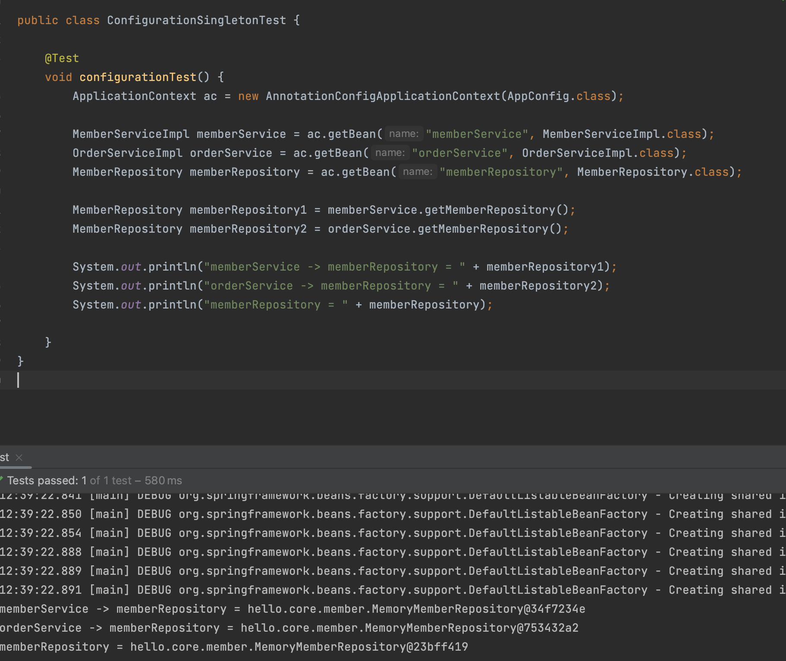
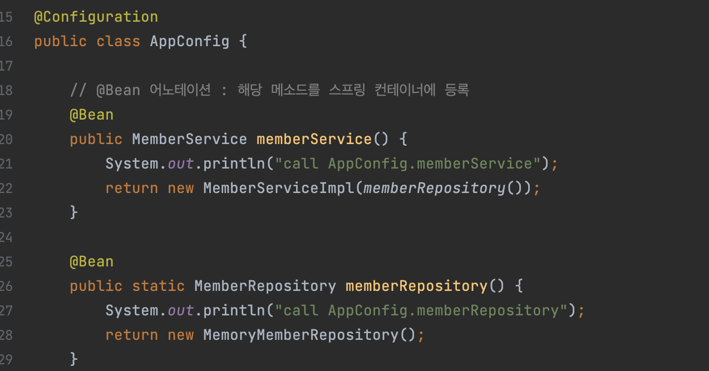
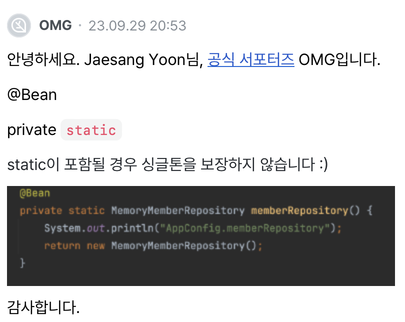
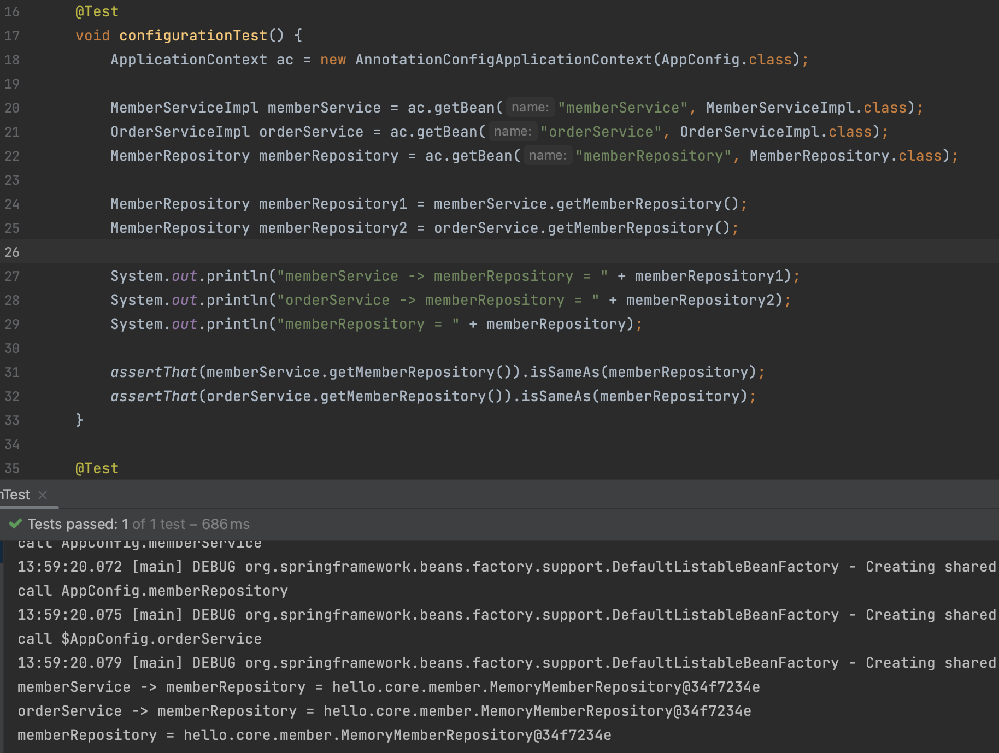

# 웹 애플리케이션과 싱글톤

스프링은 기업용 온라인 서비스 기술을 지원하기 위해 만들어짐!
그래서 대부분 웹 애플리케이션인데 웹 애플리케이션은 보통 다수의 고객이 동시에 요청을 날림


- 스프링 없는 순수한 DI 컨테이너인 AppConfig는 요청을 할 때마다 객체를 새롭게 생성
- 트래픽이 증가할수록 생성되고 소멸되는 객체가 많아짐 = 메모리 낭비
- 해결방안? 객체는 하나만 생성하되 공유하도록 설계한다! 이게 바로 싱글톤 패턴


# 싱글톤 패턴
- 클래스의 인스턴스가 딱 1개만 생성되는 것을 보장하는 디자인 패턴
    - <span style="background-color:#DCFFE4"> 디자인패턴 : 소프트웨어 공학의 소프트웨어 설계에서 공통으로 발생하는 문제에 대해 자주 쓰이는 설계 방법을 정리한 패턴 => 디자인 패턴을 참고하여 개발할 경우 개발의 효율성과 유지보수성, 운용성이 높아지며 프로그램의 최적화에 도움이 된다. <br>
    참고 : https://velog.io/@poiuyy0420/디자인-패턴-개념과-종류
    </span>

- 문제점
    - 싱글톤 패턴을 구현하는데 코드가 많이 필요함
    - 의존관계상 클라이언트가 구현 클래스에 의존하여 DIP를 위반 => OCP 위반할 가능성 높음
    - 테스트하기 어렵고 내부 속성을 변경하거나 초기화하기 어려움
    - private 생성자로 자식 클래스 만들기 어려움
    - 유연성이 떨어짐
    - 안티패턴으로도 불림

# 싱글톤 컨테이너
스프링 컨테이너를 싱글톤 컨테이너라고 하기도 함! <br>
스프링 컨테이너는 싱글톤 패턴의 문제점을 해결하면서 객체 인스턴스를 싱글톤(1개만 생성)으로 관리한다.

- 스프링 컨테이너는 싱글톤 패턴을 적용하지 않아도, 객체 인스턴스를 싱글톤으로 관리
- 스프링 컨테이너는 싱글톤 컨테이너 역할을 한다. 싱글톤 객체를 생성하고 관리하는 기능을 싱글톤 레지스트리라 한다.
- 싱글톤 패턴의 **단점**을 해결하면서 객체를 싱글톤으로 유지할 수 있다.
    - 싱글톤 패턴을 위한 지저분한 코드가 들어가지 않아도 됨
    - DIP, OCP, 테스트, private 생성자로부터 자유롭게 싱글톤 사용 가능

# 싱글톤 방식의 문제점
- 객체 인스턴스를 하나만 생성해서 공유하는 싱글톤 방식은 여러 클라이언트가 하나의 같은 객체 인스턴스를 공유하기 때문에 싱글톤 객체는 상태를 유지하게 설계하면 안된다.
- 무상태로 설계해야 한다
    - 특정 클라이언트가 값을 변경할 수 있거나 필드가 있으면 안된다. 
    - 특정 클라이언트에 의존적인 필드가 있으면 안된다.
    - 가급적 읽기만 가능해야 함
    - 필드 대신에 자바에서 공유되지 않는 지역변수, 파라미터, ThreadLocal 등을 사용해야 한다.
- 스프링 빈의 필드에 공유 값을 설정하면 큰 장애가 발생할 수 있다

# @Configuration과 싱글톤
``` java
@Configuration
public class AppConfig {

    @Bean
    public MemberService memberService() {
        return new MemberServiceImpl(memberRepository());
    }

    @Bean
    public static MemberRepository memberRepository() {
        return new MemoryMemberRepository();
    }

    @Bean
    public OrderService orderService() {
        return new OrderServiceImpl(memberRepository(), discountPolicy());
    }

    @Bean
    public DiscountPolicy discountPolicy() {
        //return new FixDiscountPolicy();
        return new RateDiscountPolicy();
    }
}

```
- memberService() 메소드에서 memberRepository() 호출하고, 이 메소드가 new MemoryMemberRepository() 를 호출
- orderService() 메소드에서 memberRepository() 호출하고, 이 메소드가 new MemoryMemberRepository() 를 호출
=> 동일한 객체를 두 번 생성하는데 싱글톤에 위배되지 않는가? 해서 테스트를 해보니 동일한 객체를 사용하는 것이 확인됨!


>  **강의를 듣다가 난 오류 확인하기!**
> 
> 왜 동일한 값이 나오지 않지? <br>
> 테스트 결과 <br>
> call AppConfig.memberService <br>
> call AppConfig.memberRepository <br>
> call AppConfig.memberRepository <br>
> call AppConfig.orderService <br>
> call AppConfig.memberRepository <br>
> 순으로 생성됨 <br><br>
> 정상적인 테스트 결과 <br>
> call AppConfig.memberService <br>
> call AppConfig.memberRepository <br>
> call AppConfig.orderService <br>
> 순으로 생성됨 <br><br>
> AppConfig의 클래스 정보를 출력한 결과 CGLIB 이라고 뜸.. <br> 인프런 강의 게시판에 검색하고 찾아냄!
> 
> 
> <br> static을 삭제하고 테스트한 결과
> 
> <br> 싱글톤 적용된 것 확인!


# @Configuration과 바이트코드 조작
- 스프링 컨테이너는 싱글톤 레지스트리이기 때문에 스프링 빈이 싱글톤이 되도록 보장해주지만, 자바 코드까지 싱글톤으로 보장해주기는 어렵다. 
- AnnotationConfigrationContext 에 파라미터로 넘긴 값도 스프링 빈으로 등록된다. => AppConfig 도 스프링 빈이다.
    - AppConfig의 클래스 정보를 출력했을 때 'class hello.core.AppConfig' 라고 나오면 순수 클래스가 맞지만, 출력 결과 'xxxCGLIB' 이라고 나온다.
    - 이것은 스프링이 CGLIB 이라는 바이트코드 조작 라이브러리를 사용해 AppConfig 클래스를 상속받은 임의의 클래스로 만들고 그 다른 클래스를 스프링 빈으로 등록한 것이다.
    - 생성된 다른 클래스를 싱글톤이 보장되도록 만든 것!
- @Configuration의 GCLIB은 @Bean이 붙은 메서드마다 이미 스프링 빈이 존재하면 존재하는 빈을 반환하고, 스프링 빈이 없으면 스프링 빈으로 등록하고 반환하는 코드가 동적으로 만들어진다.
- @Configuration을 사용하지 않고, @Bean만 사용해도 스프링 컨테이너에 스프링 빈으로 등록됨. 하지만 @Configuration의 바이트 코드를 조작하는 CGLIB을 사용할 수 없기 때문에 싱글톤 위반

