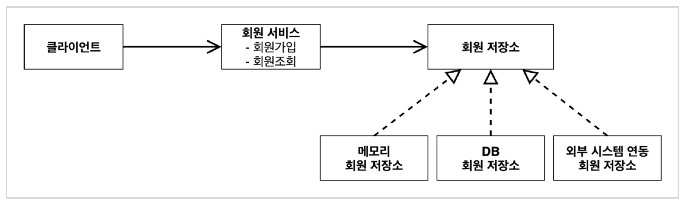
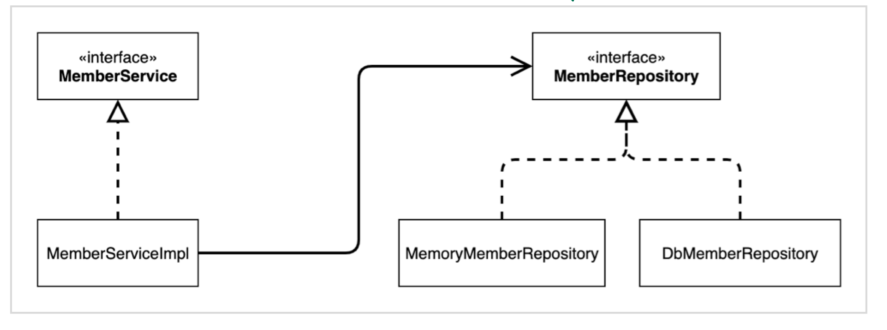
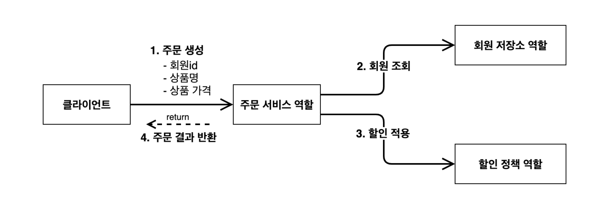
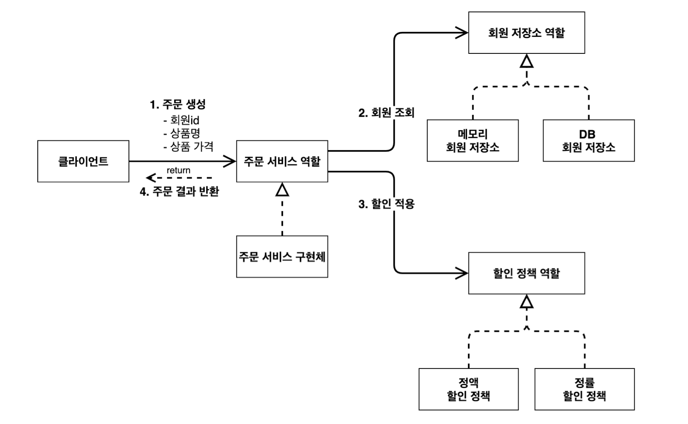
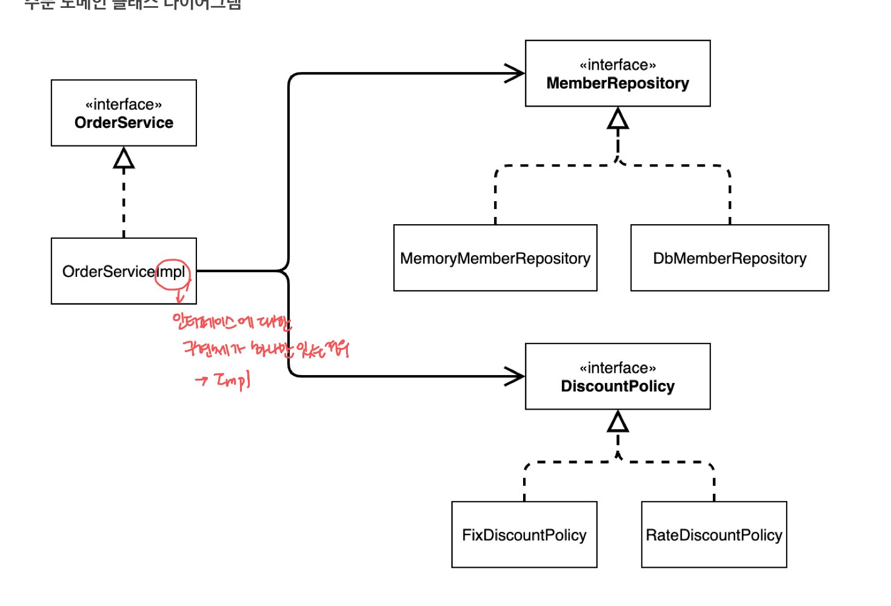
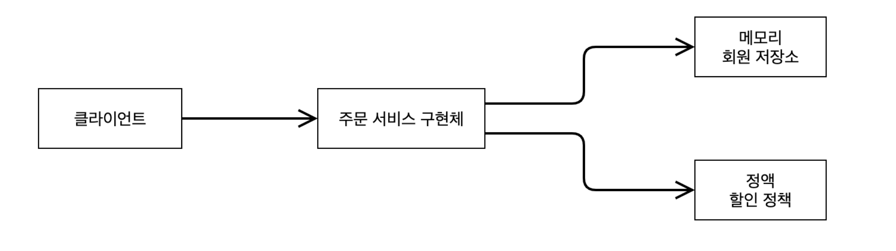

# 프로젝트 생성
스프링 부트 스타터에서 스프링 프로젝트 생성

https://start.sprint.io

- artifactId: project build 명

## 비즈니스 요구사항과 설계
- 회원 데이터는 자체 DB를 구축할 수 있고, 외부 시스템과 연동할 수 있다(미확정) 
- 할인 정책은 변경 가능성이 높다. 회사의 기본 정책을 아직 정하지 못했고, 오픈 직전까지 고민을 미루고 싶다. 최악의 경우 할인을 적용하지 않을 수도 있다.(미확정)

>미확정 사항은 인터페이스를 만들고 **역할과 구현을 구분**하여, 언제든지 구현체를 바꿀 수 있도록 설계한다.


## 도메인 설계

### 도메인 협력 관계
- 기획자도 볼 수 있는 그림

### 클래스 다이어그램
- 도메인 협력 관계를 구체화한 그림
- 서버를 실행하지 않고(정적으로) 클래스들만 분석해서 볼 수 있는 그림

### 객체 다이어그램
- 서버가 실행되고(동적으로) 클라이언트가 실제 사용하는 클래스를 볼 수 있는 그림

## 회원 도메인 설계

### 회원 도메인 협력 관계

회원 데이터에 접근하는 계층을 `회원 저장소`로 따로 두었다.`메모리 회원 저장소`, `DB 회원 저장소`, `외부 시스템 연동 회원 저장소` 중 하나의 구현체를 선택한다. 

### 회원 클래스 다이어그램

### 회원 객체 다이어그램

`MemberServiceImpl` 이라는 회원 서비스 구현체를 사용한다.  

## 회원 도메인 개발


```java
public class MemberServiceImpl implements MemberService {
 
  private final MemberRepository memberRepository = new MemoryMemberRepository();
  
  ...
}
```

- `MemberServiceImpl`은 추상화와 구체화 모두 의존 -> DIP 위반

## 주문, 할인 도메인 설계

### 주문 도메인 협력 관계


### 주문 도메인 전체

**역할과 구현을 분리**해서 자유롭게 구현 객체 조립이 가능하다. 회원 저장소와 할인 정책을 유연하게 변경할 수 있다.

### 주문 도메인 클래스 다이어그램


### 주문 도메인 객체 다이어그램

회원을 메모리에서 조회하고, 정액 할인 정책을 지원해도, 주문 서비스를 변경하지 않아도 된다. 역할들의 협력 관계를 그대로 재사용 할 수 있다.

## 주문, 할인 도메인 개발

```java
public class OrderServiceImpl implements OrderService{
  
  private final MemberRepository memberRepository = new MemoryMemberRepository();
  private final DiscountPolicy discountPolicy = new FixDiscountPolicy();
}
```

할인에 대한 수정 사항이 있다면, 할인 구현체만 수정하면 된다. 주문은 수정할 필요가 없다. 즉, 단일 책임 원칙이 잘 지켜졌다.