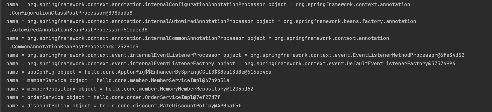
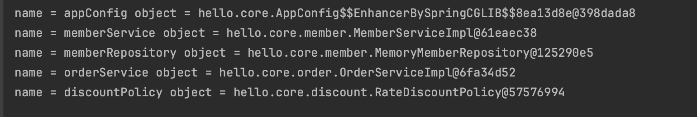
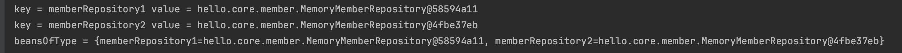
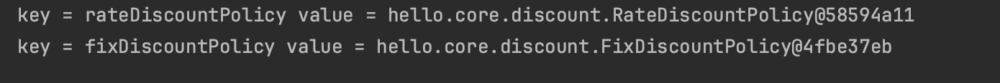

# 스프링 컨테이너 생성

```
ApplicationContext applicationContext=new AnnotationConfigApplicationContext(Config.class);
```

- `ApplicationContext`는 스프링 컨테이너
- `ApplicationContext`는 인터페이스(다형성 적용)
- `AppConfig`를 기반으로 스프링 컨테이너 생성
- `new AnnotationConfigApplicationContext()`는 `ApplicationContext`구현체

## 스프링 컨테이너 생성 과정

1. 스프링 컨테이너 생성
    - `new AnnotationConfigApplicationContext(AppConfig.class)`
    - `AppConfig.class`를 구성 정보로 스프링 컨테이너 생성


2. 스프링 빈 등록
    - 스프링 컨테이너는 파라미터로 넘어온 설정 클래스(`AppConfig.class`)를 사용해서 스프링 빈 등록
    - 빈 이름은 메소드 이름을 사용
    - 직접 부여도 가능 (`@Bean(name="memberService1")`)

> 빈 이름은 항상 다른 이름을 부여해야 한다.


3. 스프링 빈 의존 관계 설정
    - 스프링 컨터이너는 설정 정보를 참고해서 의존 관계를 주입
    - 스프링 빈이 연결됨(객체 참조값 연결)


## 컨테이너에 등록된 모든 빈 조회
```java
    void findAllBean() {
        String[] beanDefinitionNames = ac.getBeanDefinitionNames();
        for (String beanDefinitionName : beanDefinitionNames) {
        Object bean = ac.getBean(beanDefinitionName);
        System.out.println("name = " + beanDefinitionName + " object = " + bean);
        }

        }
```
- 모든 빈 출력하기
    - `ac.getBeanDefinitionName()`
        - 스프링에 등록된 모든 빈 이름 조회
    - `ac.getBean()`
        - 빈 이름으로 빈 객체 조회
      


```java
    void findApplicationBean() {
        String[] beanDefinitionNames = ac.getBeanDefinitionNames();
        for (String beanDefinitionName : beanDefinitionNames) {
        BeanDefinition beanDefinition = ac.getBeanDefinition(beanDefinitionName);
        if (beanDefinition.getRole() == BeanDefinition.ROLE_APPLICATION) {
        Object bean = ac.getBean(beanDefinitionName);
        System.out.println("name = " + beanDefinitionName + " object = " + bean);
        }
        }

        }
```

- 애플리케이션 빈 출력하기
    - 스프링이 내부에서 사용하는 빈은 제외하고, 내가 등록한 빈만 출력
    - 스프링이 내부에서 사용하는 빈은 `getRole()`로 구분 가능
        - `ROLE_APPLICATION`: 사용자가 정의한 빈
        - `ROLE_INFRASTRUCTURE`: 스프링이 내부에서 사용하는 빈
      


## 스프링 빈 조회 - 기본
스프링 컨테이너에서 스프링 빈을 찾는 가장 기본적인 방법
```java
    void findBeanByName() {
        MemberService memberService = ac.getBean("memberService", MemberService.class);
        Assertions.assertThat(memberService).isInstanceOf(MemberServiceImpl.class);
```
- `ac.getBean(빈 이름, 타입)`

```java
    void findBeanByType() {
        MemberService memberService = ac.getBean(MemberService.class);
        Assertions.assertThat(memberService).isInstanceOf(MemberServiceImpl.class);

    }


    void findBeanByName2() {
        MemberService memberService = ac.getBean("memberService", MemberServiceImpl.class);
        Assertions.assertThat(memberService).isInstanceOf(MemberServiceImpl.class);

    }
```
- `ac.getGean(타입)`
- 구체 타입으로 조회하면 변경 시 유연성이 떨어짐

## 스프링 빈 조회 - 동일한 타입이 둘 이상인 경우
```java
    void findBeanByTypeDuplicate() {
        Assertions.assertThrows(NoUniqueBeanDefinitionException.class,
            () -> ac.getBean(MemberRepository.class));
    }
```
- 타입으로 조회 시 같은 타입의 스프링 빈이 둘 이상이면 오류가 발생

```java
    void findBeanByName() {
        MemberRepository memberRepository = ac.getBean("memberRepository1", MemberRepository.class);
        assertThat(memberRepository).isInstanceOf(MemberRepository.class);
    }
```
- 빈 이름을 지정해서 오류를 해결
```java
    void findAllBeanByType() {
        Map<String, MemberRepository> beansOfType = ac.getBeansOfType(MemberRepository.class);
        for (String key : beansOfType.keySet()) {
            System.out.println("key = " + key + " value = " + beansOfType.get(key));
        }
        System.out.println("beansOfType = " + beansOfType);
        assertThat(beansOfType.size()).isEqualTo(2);
    }
```


- `ac.getBeanOfType()`을 사용하면 해당 타입의 모든 빈 조회 가능

## 스프링 빈 조회 - 상속 관계
```java
    void findAllBeanByParentType() {
        Map<String, DiscountPolicy> beansOfType = ac.getBeansOfType(DiscountPolicy.class);
        for (String key : beansOfType.keySet()) {
            System.out.println("key = " + key + " value = " + beansOfType.get(key));

        }
    }
```


- 부모 타입으로 조회하면 자식 타입도 함께 조회
```java
    void findAllBeanByObjectType() {
        Map<String, Object> beansOfType = ac.getBeansOfType(Object.class);
        for (String key : beansOfType.keySet()) {
            System.out.println("key = " + key + " value = " + beansOfType.get(key));

        }
    }
```
- 모든 자바 객체의 최고 부모인 `Object`타입으로 조회하면 모든 스프링 빈 조회

## BeanFactory와 ApplicationContext
- `ApplicationContext`는 `BeanFactory`의 기능을 상속받아 스프링 빈을 관리한다.
- `ApplicationContext`은 편리한 부가 기능도 제공한다.
- `BeanFactory`를 사용할 일은 거의 없다.
- `BeanFactory`나 `ApplicationContext`를 스프링 컨테이너라고 한다.

### BeanFactory
- 스프링 컨터이너의 최상위 인터페이스
- 스프링 빈을 관리하고 조회하는 역할
- `getBean()` 제공

### ApplicationContext
- `BeanFactory`기능을 모두 상속받아서 제공
- 메시지 소스를 활용한 국제화 기능 제공
    - 한국에서 들어오면 한국어로, 영어권에서 들어오면 영어로 출력
- 환경변수
    - 로컬, 개발, 운영 등을 구분해서 철
- 애플리케이션 이벤트
    - 이벤트를 발행하고 구동하는 모델을 지원
- 편리한 리소스 조회
    - 파일, 클래스패스, 외부 등에서 리소스 편리하게 조회

## 스프링 빈 설정 메타 정보 - BeanDefinition
- 스프링이 다양한 설정 형식을 지원하는 데에 `BeanDefinition` 이라는 추상화가 그 역할을 한다.
    - XML을 읽어서 `BeanDefinition`을 만듦
    - 자바 코드를 읽어서 `BeanDefinition`을 만듦
    - 스프링 컨테이너는 XML인지, 자바 코드인지 몰라도 됨
- `BeanDefinition`을 빈 설정 메타정보라고 한다.
    - `@Bean`, `<bean>`당 각각 하나씩 메타정보가 생성
- 스프링 컨테이너는 메타 정보를 기반으로 스프링 빈을 생성한다.