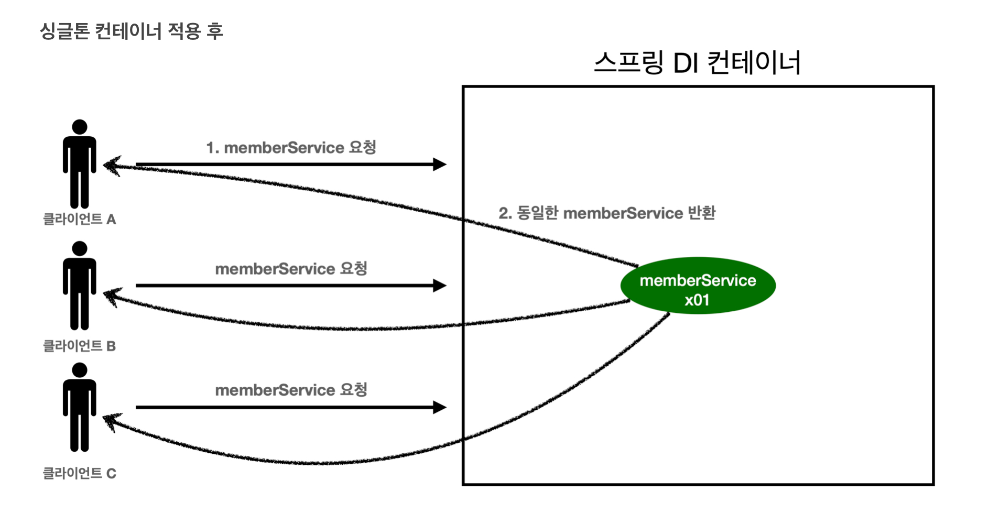
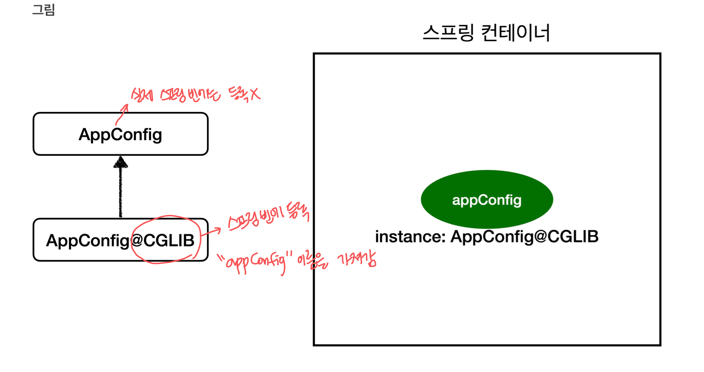

# 웹 애플리케이션과 싱글톤

스프링은 기업용 온라인 서비스 기술을 지원하기 위해 탄생했으며, 대부분의 스프링 애플리케이션은 웹 애플리케이션이다.
웹 애플리케이션은 보통 여러 고객이 동시에 요청을 한다.

## 스프링 없는 순수한 DI 컨테이너

```java
@Configuration
public class AppConfig {

    @Bean
    public MemberService memberService() {
        System.out.println("AppConfig.memberService");
        return new MemberServiceImpl(memberRepository());
    }

    @Bean
    public MemoryMemberRepository memberRepository() {
        System.out.println("AppConfig.memberRepository");
        return new MemoryMemberRepository();
    }
}
```

```java
public class SingletonTest {

    @Test
    void pureContainer() {

        AppConfig appConfig = new AppConfig();

        MemberService memberService1 = appConfig.memberService();

        MemberService memberService2 = appConfig.memberService();

        System.out.println("memberService1 = " + memberService1);
        System.out.println("memberService2 = " + memberService2);

        assertThat(memberService1).isNotSameAs(memberService2); // 테스트 통과

    }
}
```

스프링 없는 수수한 DI 컨테이너인 `AppConfig`는 요청할 때 마다 객체를 새로 생성한다. 
위 코드의 경우 JVM 메모리에 계속 객체가 생성되어 올라가게 된다. 
고객 트래픽이 초당 100이 나오면 초당 100개의 객체가 생성되고 소멸되어 메모리 낭비가 심해진다.
해결을 위해 해당 객체가 딱 1개만 생성되고 이를 공유하도록 설계할 수 있다. 이를 싱글톤 패턴이라고 한다.

## 싱글톤 패턴
싱글톤 패턴은 클래스의 인스턴스가 딱 1개만 생성되는 것을 보장하는 디자인 패턴이다.
```java
public class SingletonService {

    // 1. 
    private static final SingletonService instance = new SingletonService(); // 

    // 2.
    public static SingletonService getInstance() { 
        return instance;
    }

    private SingletonService(); 

    public void logic() {
        System.out.println("싱글톤 객체 로직 호출");
    }
}
```

1. static 영역에 객체를 한 개만 생성한다.
2. 객체 인스턴스가 필요하면 `getInstance` 메서드를 통해서만 조회할 수 있다.
   메서드를 호출하면 항상 같은 인스턴스를 반환한다. 
3. 생성자를 `private`으로 하여 외부에서 `new` 키워드를 사용한 객체 생성을 막는다.

### 싱글톤 패턴의 문제점
- 싱글톤 패턴을 구현을 위해 작성할 코드가 많아진다.
- 의존 관계상 클라이언트가 구체 클래스에 의존한다.
  - `AppConfig`에서 `MemberService`를 꺼내려면 `MemberServiceImpl.getInstance()`메소드로 꺼내야 함 -> DIP 반
- 내부 속성을 변경하거나 초기화하기 어렵다.
- private 생성자 때문에 자식 클래스를 만들기 어렵다.
- 유연성이 떨어진다.
- 안티패턴으로 불리기도 한다.

## 싱글톤 컨테이너
- 싱글톤 컨테이너는 싱글톤 패턴의 문제점을 해결하면서, 객체 인스턴스를 싱글톤으로 관리한다.
  - 싱글톤 패턴을 위한 코드가 필요 없음
  - DIP, OCP, 테스트, `private` 생성자로부터 자유롭게 싱글톤 사용 가능
- 스프링 컨테이너는 싱글톤 패턴을 적용하지 않아도 객체 인스턴스를 싱글톤으로 관리한다.
  - 컨테이너는 `@Bean` 어노테이션의 객체를 하나만 생성해서 관리
- 스프링 컨테이너는 싱글톤 컨테이너 역할을 한다.
  - 싱글톤 객체를 생성하고 관리하는 기능을 싱글톤 레지스트리라고 함

## 싱글톤 컨테이너를 사용하는 테스트 코드

```java
public class SingletonContainerTest {
    
    @Test
    void springContainer() {

      ApplicationContext ac = new AnnotationConfigApplicationContext(AppConfig.class);

      MemberService memberService1 = ac.getBean("memberService", MemberService.class);

      MemberService memberService2 = ac.getBean("memberService", MemberService.class);

      System.out.println("memberService1 = " + memberService1);
      System.out.println("memberService2 = " + memberService2);

      assertThat(memberService1).isSameAs(memberService2); // 테스트 통과
      
    }
}
```


스프링 컨테이너는 이미 만들어진 객체를 공유해서 효율적으로 재사용할 수 있도록 한다.


## 싱글톤 방식의 주의점
객체 인스턴스를 하나만 생성해서 공유하는 싱글톤 방식은 상테를 유지하도록 설계하면 안된다. -> 무상태(stateless) 설계!

- 특정 클라이언트에 의존적인 필드가 있으면 안된다.
- 특정 클라이언트가 값을 변경할 수 있는 필드가 있으면 안된다.
- 가급적 읽기만 가능해야 한다.
- 필드 대신에 자바에서 공유되지 않는 지역변수, 파라미터, ThreadLocal 등을 사용해야 한다.
>**ThreadLocal**
> 
> JDK 1.2부터 제공되는 클래스이다. ThreadLocal을 활용하면 스레드 단위로 로컬 변수를 사용할 수 있어 전역 변수처럼 여러 메소드에서 활용 가능하다.
> 사용이 끝난 후에는 ThreadLocal정보를 제거해서 사이드 이펙트가 발생하지 않도록 해야 한다.

 
### 상태를 유지하는 경우 발생하는 문제점 예시
```java
public class StatefulService {

    private int price;

    public void order(String name, int price) {
        System.out.println("name = " + name + " price = " + price);
        this.price = price;
    }

    public int getPrice() {
        return price;
    }
}
```

```java
public class StatefulServiceTest {

    @Test
    void statefulServiceSingleton() {
        ApplicationContext ac = new AnnotationConfigApplicationContext(TestConfig.class);

        StatefulService statefulService1 = ac.getBean("statefulService", StatefulService.class);
        StatefulService statefulService2 = ac.getBean("statefulService", StatefulService.class);
        
        statefulService1.order("userA", 10000);
        statefulService2.order("userB", 20000);

        System.out.println("price = " + price);
        
        Assertions.assertThat(statefulService1.getPrice()).isEqualTo(20000);
        
        static class TestConfig {
            
            @Bean
            public StatefulService statefulService() {
                return new StatefulService();
            }
        }
    }
}
```

- `statefulService`의 `price` 필드는 공유되는 필드이다. 
  - 특정 클라이언트가 값을 변경
- userA의 주문 금액은 10,000원 이어야 하는데, 20,000원이라는 결과가 나왔다.

```java
public class StatelessService {

    private int price;

    public int order(String name, int price) {
        System.out.println("name = " + name + " price = " + price);
        return price;
    }
}
```


## @Configuration과 싱글톤
```java
@Configuration
public class AppConfig {

    @Bean
    public MemberService memberService() {
        System.out.println("AppConfig.memberService");
        return new MemberServiceImpl(memberRepository());
    }

    @Bean
    public MemoryMemberRepository memberRepository() {
        System.out.println("AppConfig.memberRepository");
        return new MemoryMemberRepository();
    }

    @Bean
    public OrderService orderService() {
        System.out.println("AppConfig.orderService");
        return new OrderServiceImpl(memberRepository(), discountPolicy());
    }
}

```

`memberService` 빈을 만드는 코드에서 `memberRepository`를 호출한다. 
그런데 `orderService` 빈을 만드는 코드에서도 `memberRepository`를 호출한다.
`MemoryMemberRepository`가 2 개가 생성되면서 싱글톤이 깨지는 것처럼 보인다. 

### @Configuration과 바이트코드

스프링 컨테이는 내가 만든 클래스가 아니라 CGLIB이라는 바이트코드 조작 라이브러리를 사용해서, 내가 만든 클래스를 상속받은 임의의 클래스를 만들고, 이 임의의 클래스를 스프링 빈으로 등록한다.

- `@Bean`이 붙은 메서드가 이미 스프링 빈이 존재하면 존재하는 빈을 반환하고, 존재하지 않는다면 스프링 빈으로 등록하고 반환한다. 
- 싱글톤이 보장된다.

> `AppConfig@CGLIB`는 `AppConfig`의 자식 타입으로, `AppConfig`타입으로 조회 가능하다.

> **`@Configuration`을 적용하지 않고, `@Bean`만 적용한다면?**
> 
> `@Configuration`을 붙이면 바이트코드를 조작하는 CGLIB 기술을 사용해서 싱글톤을 보장한다. 
> 하지만 어노테이션이 빠지게 된다면, CGLIB 기술 없이 순수하게 스프링 빈에 등록된다. 
> 
> `AppConfig`를 예로 들었을 때,  `memberRepository`처럼 의존 관계 주입이 필요해서 여러 번 호출하는 경우, 매 번 새로운 `MemoryMemberRepository` 인스턴스를 생성하게 된다.
> 따라서 싱글톤이 깨지게 된다.


