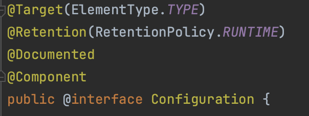
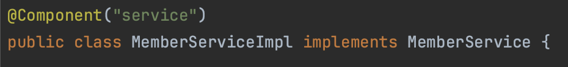
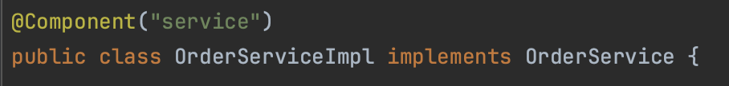
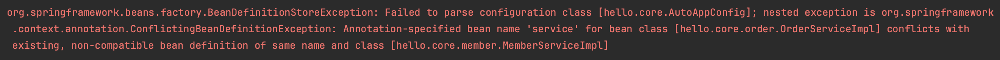
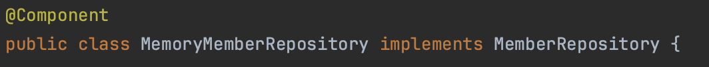
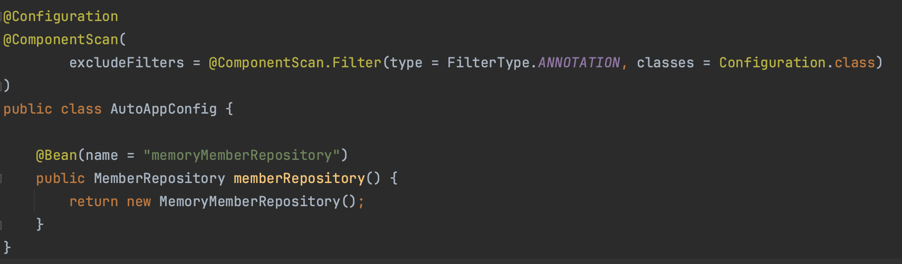
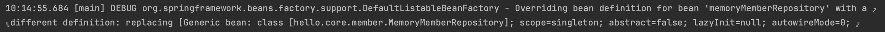
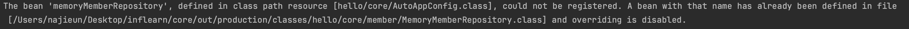

# 컴포넌트 스캔과 의존 관계 자동 주입
이전까지 스프링 빈을 등록할 때 `@Bean`이나 XML의 `<bean>`을 통해서 직접 등록할 스프링 빈을 나열했다.
이런 방법은 등록해야 할 스프링 빈이 많아진다면 등록이 번거로워지고, 누락하는 문제가 발생할 수도 있다. 

스프링 빈은 설정 정보가 없어도 자동으로 스프링 빈을 등록하는 `@ComponentScan` 기능을 제공하며, 의존 관계를 자동으로 주입하는 `@Autowired` 기능을 제공한다.

## 어노테이션 
```java
@Configuration
@ComponentScan(
        excludeFilters = @ComponentScan.Filter(type = FilterType.ANNOTATION, classes = Configuration.class)
)
public class AutoAppConfig {

}
```

```java
@Component
public class memoryMemberRepository implements MemberRepository {}
```

```java
@Component
public class MemberServiceImpl implements MemberService {
    private final MemberRepository memberRepository;
    
    @Autowired
    public MemberServiceImpl(MemberRepository memberRepository){
        this.memberRepository = memberRepository;
    }
}
```

```java
@Component
public class OrderServiceImpl implements OrderService {
    
    private final MemberRepository memberRepository;
    private final DiscountPolicy discountPolicy;
    
    @Autowired
    public OrderServiceImpl(MemberRepository memberRepository, DiscountPolicy discountPolicy){
        this.memberRepository = memberRepository;
        this.discountPolicy = discountPolicy;
    }
}
```
- 기존의 `AppConfig`와 다르게 `@Bean`으로 등록한 클래스가 없다.

### @ComponentScan
- `@ComponentScan`은 `@Component`가 붙은 모든 클래스를 스프링 빈으로 등록한다.
- 스프링 빈의 기본 이름은 클래스명으로 하되, 맨 앞글자만 소문자를 사용한다.
  - 빈 이름 기본 전략: MemberServiceImpl클래스 -> memberServiceImpl로 빈 저장
  - 빈 이름 직접 지정: 스프링 빈의 이름을 직접 지정하고 싶으면 `@Component("memberService2")`


> 컴포넌트 스캔을 하면 `@Configuration`이 붙은 설정도 자동으로 등록된다. `@Configuration`이 `@Component`를 포함하기 때문이다.


### @Autowired
- 생성자에 `@Autowired`를 지정하면 스프링 컨테이너가 자동으로 해당 스프링 빈을 찾아서 주입한다. 
- 생성자에 파라미터가 여러 개라도 다 찾아서 주입한다.

## 탐색 위치와 기본 스캔 대상

### 탐색할 패키지의 시작 위치 지정
필요한 위치부터 탐색하도록 컴포넌트 스캔 시작 위치를 지정할 수 있다.
```java
@ComponentScan(
        basePackages = "hello.core"
)
```
- `basePages`: 탐색할 패키지의 시작 위치를 지정한다. 
- `basePakageClasses`: 지정한 클래스가 있는 패키지를 탐색 시작 위치로 지정한다.
- 만약 시작 위치를 지정하지 않으면 `@ComponentScan`이 붙은 설정 정보 클래스의 패키지가 시작 위치가 된다.

> **권장 방법**
> 
> 패키지 위치를 따로 지정하지 않고, 설정 정보 클래스의 위치를 프로젝트 최상단에 두어 프로젝트 내의 모든 `@Component`를 스캔하도록 한다. 
>
>스프링 부트의 시작 정보인 `@SpringBootApplication`을 프로젝트 루트에 위치하도록 하는 것이 관례인데, 이 설정 안에 `@ComponentScan`이 들어있다.
> 

### 컴포넌트 스캔 기본 대상
- `@Component`
- `@Controller`
  - MVC 컨트롤러에서 사용
- `@Service`
  - 비즈니스 로직에서 사용
- `@Repository`
  - 데이터 접근 계층에서 사용
  - 데이터 계층의 예외를 스프링 예외로 변환
- `@Configuration`
  - 설정 정보에서 사용
  - 스프링 빈이 싱글톤을 유지하도록 처리

## 중복 등록과 충돌
컴포넌트 스캔에서 빈 이름을 등록하는 데 충돌이 발생하는 두 가지 상황이 있다.
1. 자동 빈 등록 vs 자동 빈 등록
2. 자동 빈 등록 vs 수동 빈 등록

### 자동 빈 등록 vs 자동 빈 등록
컴포넌트 스캔에 의해 자동으로 빈이 등록되는데, 이름이 같은 경우에 스프링은 `ConflictBeanDefinitionException`을 발생시킨다.





### 자동 빈 등록 vs 수동 빈 등록
자동 빈 등록과 수동 빈 등록에서 이름이 충돌되면 수동 빈이 등록 우선권을 가진다. 따라서 수동 빈이 자동 빈을 오버라이딩 한다.





같은 이름의 자동 빈과 수동 빈 등록시 오버라이딩된다는 로그가 남게 된다.


최근 스프링 부트에서는 자동 빈과 수동 빈의 등록 충돌 발생 시, 오류가 발생하도록 기본 값을 바꾸었다.  